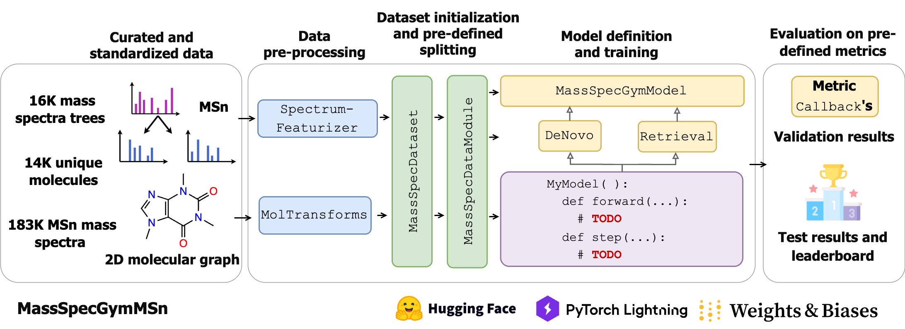

# MassSpecGymMSn

<p>
  <a href="https://huggingface.co/datasets/roman-bushuiev/MassSpecGym"></a>
  <a href="https://pypi.org/project/massspecgymmsn"></a>
  <a href="https://github.com/pytorch/pytorch"></a>
  <a href="https://github.com/Lightning-AI/pytorch-lightning"></a>
  <a href="https://github.com/psf/black"></a>
</p>

<p align="center">
  
</p>

MassSpecGymMSn is an extension of the original [MassSpecGym](https://github.com/pluskal-lab/MassSpecGym) benchmark to **multi-stage** mass spectrometry (MSn) data. It provides two machine-learning challenges, each with a “bonus” variant using ground-truth chemical formulae:

- 💥 **Molecule retrieval**  
  _(MSn spectrum tree → ranked list of candidate structures)_  
  - ✨ **Bonus:** retrieval among candidates with ground-truth formulae  
- 💥 **De novo molecule generation**  
  _(MSn spectrum tree → molecular structure)_  
  - ✨ **Bonus:** de novo generation given spectrum + true formula  


Unlike the original MassSpecGym (which only covers MS2), MassSpecGymMSn supports fragmentation trees up to MS5. This repository provides data loaders, preprocessing utilities, and a standardized benchmark for both challenges.

---

## 📦 Installation

Clone the repository and install from source:

```bash
git clone ssh://git@github.com/Jozefov/MassSpecGymMSn.git
cd MassSpecGymMSn
pip install .
```

Or install in editable mode for development:

```bash
pip install -e .
```
To install optional extras (e.g., dev, notebooks):

```bash
pip install .[dev,notebooks]
```
Alternatively, with conda:
```bash
conda create -n massspecgymmsn python==3.11
conda activate massspecgymmsn
pip install .
```

## 🍩 Getting started with MassSpecGym

<p align="center">
  
</p>

MassSpecGymMSn’s infrastructure consists of predefined components that serve as building blocks for the implementation and evaluation of new models.

First of all, the MassSpecGymMSn dataset is available as a [Hugging Face dataset](https://huggingface.co/datasets/roman-bushuiev/MassSpecGym) and ready for use in downstream predictive tasks.

## ⚙️ Retrieval Challenge

In the retrieval challenge, each example is an MSn fragmentation tree (as a PyTorch Geometric graph) and set with up to 256 candidate molecules. The goal is to predict a molecular representation (e.g., fingerprint) and rank the candidates so that the true molecule appears among the top k.

```python
from massspecgym.data.datasets import MSnRetrievalDataset
from massspecgym.data.transforms import MolFingerprinter
from massspecgym.data import MassSpecDataModule
from massspecgym.featurize import SpectrumFeaturizer

# 1. A config dict specifies which spectrum attributes to encode and their preprocessing:
config = {
    'features': ['collision_energy', 'adduct', 'retention_time', 'binned_peaks'],
    'feature_attributes': {
        'atom_counts': {
            'top_n_atoms': 12,
            'include_other': True,
        },
    },
}

# 2. Create the featurizer for spectra
featurizer = SpectrumFeaturizer(config, mode='torch')

# 3. Paths to your data files
mass_spectra       = "20241211_msn_library_pos_all_lib_MSn.mgf"
candidates_json    = "MassSpecGymMSn_retrieval_candidates_mass.json"
candidates_cache   = "MassSpecGymMSn_retrieval_candidates_mass.h5"  # optional cache
split_file         = "20241211_split.tsv"

# 4. Initialize the retrieval dataset
fp_size = 2048
dataset = MSnRetrievalDataset(
    pth=mass_spectra,
    candidates_pth=candidates_json,
    featurizer=featurizer,
    cache_pth=candidates_cache,
    mol_transform=MolFingerprinter(fp_size=fp_size),
)

# 5. Wrap in a Lightning DataModule
batch_size = 12
data_module = MassSpecDataModule(
    dataset=dataset,
    batch_size=batch_size,
    split_pth=split_file,
    num_workers=0,
)

# 6. Prepare and set up (downloads/caches if needed)
data_module.prepare_data()
data_module.setup(stage="test")
data_module.setup()

# 7. Get PyTorch DataLoaders
train_loader = data_module.train_dataloader()
val_loader   = data_module.val_dataloader()
test_loader  = data_module.test_dataloader()
```

> **Notes**
> - On first run, the candidate set is featurized and cached to `cache_file`. Subsequent runs reuse this cache.  
> - Switch between **standard** (`*_mass.json`) and **bonus** (`*_formula.json`) by changing `candidates_pth`.

## ⚙️ De novo Generation Challenge

In the de novo challenge, each example is an MSn tree without any candidate set. The task is to generate (or predict) the molecular graph directly from the masss spectra tree.

```python
from massspecgym.data.datasets import MSnDataset
from massspecgym.featurize import SpectrumFeaturizer
from massspecgym.data import MassSpecDataModule

# 1. Reuse the same featurizer as above
featurizer = SpectrumFeaturizer(config, mode='torch')

# 2. Initialize the MSn dataset (no molecular transform)
msn_dataset = MSnDataset(
    pth=mass_spectra,
    featurizer=featurizer,
    mol_transform=None,
)

# 3. Wrap in the same DataModule
de_novo_data_module = MassSpecDataModule(
    dataset=msn_dataset,
    batch_size=batch_size,
    split_pth=split_file,
    num_workers=0,
)

# 4. Prepare and set up
de_novo_data_module.prepare_data()
de_novo_data_module.setup(stage="test")
de_novo_data_module.setup()

# 5. Get PyTorch DataLoaders
train_loader = de_novo_data_module.train_dataloader()
val_loader   = de_novo_data_module.val_dataloader()
test_loader  = de_novo_data_module.test_dataloader()
```

## 🔗 Data

All MSn spectra, candidate sets, and split files are available for download from Hugging Face:

Link coming soon


## 🚀 Next Steps

1. **Implement your model**  
Inherit from `RetrievalMassSpecGymModel` or `DeNovoMassSpecGymModel` and override `forward` and `step`.  
Models are developed and maintained in a separate repository: [PhantoMS](https://github.com/pluskal-lab/PhantoMS)

2. **Train & evaluate**  
Use PyTorch Lightning’s `Trainer` for seamless training, validation, and testing.

   

---

## 🌱 What's Next

MassSpecGymMSn is just getting started, this is an early version, and there's much more to come.

In the near future, we plan to:
- Add more MSn data 
- Include new tools for preprocessing and evaluation
- Further improve support for generative models and other advanced workflows

This project will keep growing significantly, and we’re excited to share more soon. Stay tuned!


## 📚 References


If you use MassSpecGymMSn in your work, please cite the following paper:

```bibtex
@mastersthesis{jozefov2025massspecgymmsn,
  title={Predicting molecular structures from multi-stage MSn fragmentation trees using graph neural networks and DreaMS foundation model},
  author={Jozefov, Filip},
  year={2025},
  school={Faculty of Informatics, Masaryk University}
}
```

For the original MassSpecGym benchmark:

```bibtex
@article{bushuiev2024massspecgym,
      title={MassSpecGym: A benchmark for the discovery and identification of molecules}, 
      author={Roman Bushuiev and Anton Bushuiev and Niek F. de Jonge and Adamo Young and Fleming Kretschmer and Raman Samusevich and Janne Heirman and Fei Wang and Luke Zhang and Kai Dührkop and Marcus Ludwig and Nils A. Haupt and Apurva Kalia and Corinna Brungs and Robin Schmid and Russell Greiner and Bo Wang and David S. Wishart and Li-Ping Liu and Juho Rousu and Wout Bittremieux and Hannes Rost and Tytus D. Mak and Soha Hassoun and Florian Huber and Justin J. J. van der Hooft and Michael A. Stravs and Sebastian Böcker and Josef Sivic and Tomáš Pluskal},
      year={2024},
      eprint={2410.23326},
      url={https://arxiv.org/abs/2410.23326},
      doi={10.48550/arXiv.2410.23326}
}
```